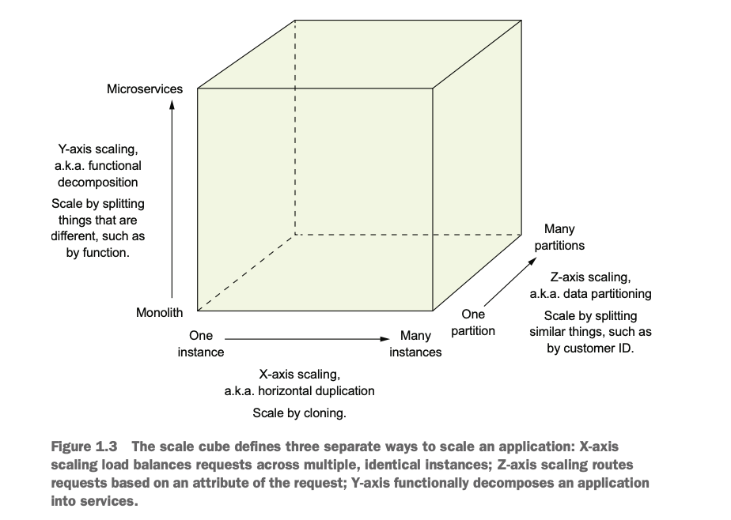

# Microservices Patterns by Chris Richardson.

This file summarizes my notes from the Clean Architecture book.

### Index
1. [Escaping Monolithic hell](#chapter_1)
2. [Decomposition Strategies](#chapter_2)

## <a name="chapter_1">Chapter 1 - Escaping Monolithic hell</a>
1. In the early cycles of development of the monolithic application, it is 
    1. simple to develop
    2. easy to make radical changes to the application
    3. straightforward to test
    4. straightforward to deploy
    5. easy to scale
2. As the monolithic application outgrows its architecture
    1. complexity intimidates developers
    2. development slows down
    3. Path from commit to deployment becomes long and arduous
    4. scaling becomes difficult
    5. the app gets locked into increasingly obsolete technology stack
    6. reliability reduces
3. Scale cube and Microservices
    1. Microservices
        1. MicroService is an architectural style that functionally decomposes an application into a set of services.
        1. Each service has a focused, cohesive set of responsibilities. 
        3. Here, the services communicate via API
    2. Scaling cube and Microservices

       

        1. X-Axis (a.k.a. horizontal duplication) - Scale by cloning
            1. here, you run clones of the application behind load balancer.
            2. This is a great way of improving the capacity and availability of the service.
        2. Z-Axis (a.k.a. data partitioning) - scale by splitting similar things, (such as by customer ids).
            1. Each instance in here is responsible only for a subset of the data.
            2. The router in front of the instances uses the request attribute to route it to appropriate instance.
            3. Helps to solve problems about capacity and availability.
        3. Y-Axis (a.k.a. functional decomposition) - scale by splitting things that are different.
            1. Helps to solve the problem of increasing development and application complexity.
            2. Here, we aim to divide up the service into multiple mini-services that implements narrowly focused functionality.

    3. Modularity
        1. The microservice architecture uses services as the unit of modularity.  
    4. Comparing SOA with Microservices

        | subject | SOA | Microservice |
        | :----- | :------ | :------ |
        | Inter-Service communication | smart pipes (such as Enterprise Service Bus). | Dumb pipes, REST, or gRPC etc.
        | Data | global data model and shared databases | Data model per service |
        | Typical service | Larger Monolithic application | Smaller Service |

4. Benefits and drawbacks of Microservice architecture  
    1. Benefits
        1. Enables continuous delivery, deployment for large, complex applications
            1. Reduces time to market.
            2. Improved reliability.
            3. Employee satisfaction is higher.
        2. services are small and easily maintained
        3. services are independently deployable.
        4. services are independently scalable.
        5. It enables the teams to be autonomous.
        6. It allows easy experimenting and adoption of new technologies.
        7. It has better fault isolation.
    2. Drawbacks
        1. Finding the right services is challenging.
        2. Distributed systems are complex.
        3. Deploying features spanning across multiple services requires careful coordination.
        4. Deciding when to adopt is difficult.
    
         
## <a name="chapter_2">Chapter 2 - Decomposition strategies</a>
1. What is Microservice architecture?
   1. What is Service Architecture and why does it matter?
      1. A software architecture is a decomposition into parts (the elements) and the relationship between those parts.
      2. 4+1 view of the architecture

         | View | Created By | Elements | Relations |
         | :----- | :------ | :------ | :------ |
         | Logical | Developers | Classes and Packages | Relations between them |
         | Implementation | Introduced by build system | Executable modules | Dependencies |
         | Process | Running components | Processes | IPC |
         | Deployment | Processes running on machines | machines and processes | Networking |
         1. Scenarios => They animate the views, each scenario describes as how various components in any particular view collaborate in order to handle a request.
      3. Requirements - Choice of architecture affects both types of requirements.
         1. Functional - what an application must do, user stories and use cases.
         2. QoS requirements - quality attributes of the service, availability, scalability, reliability, maintainability, testability, deployability etc.
   2. Architecture styles
      1. Layered architecture - A layer can only depend on the layer(s) below it. eg. OSI layer etc.
      2. Hexagonal architecture
         1. Puts business logic in the center, surrounded by Ports and adapters.
         2. Ports
            1. Inbound ports => API as exposed by the service
               1. Example: Service interface
            2. Outbound ports => how the service invokes other external systems.
               1. Example: Repository interface
         3. Adapters
            1. Inbound - handles an inbound request by invoking an inbound port
               1. example: REST endpoints 
            2. Outbound - handles requests from business logic by invoking an external application/service.
               1. example: DAO
   3. Microservice architecture is an architectural style.
      1. It structures the application as a collection of loosely coupled, independently deployable services.
2. Defining an applications Microservice architecture
   1. It's a three-step process
      1. Identify Operations
         1. System Operation - abstraction of a request that the application must handle. Either a command to update the data or a query to retrieve the data.
      2. Identify Services - there are multiple strategies
         1. Define a service around business capabilities.
         2. Organize service around domain-driven design subdomains.
      3. Define Service APIs and collaborations
         1. if service is implementing the whole operation by itself or requires to collaborate with other service.
   2. Obstacles
      1. Network latencies
      2. Synchronous communication vs Availability balance
      3. Data consistency across the services
      4. God classes
   3. Identifying Operations
      1. From the user stories, a domain model is created with which the operations are described.
      2. Behavior od the system operation is described in terms of its effect on one or more domain objects and the relationships between them.
   4. Defining Services [WIP]
      1. Decompose by business capability
      2. Decompose by subdomain